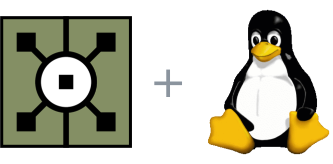
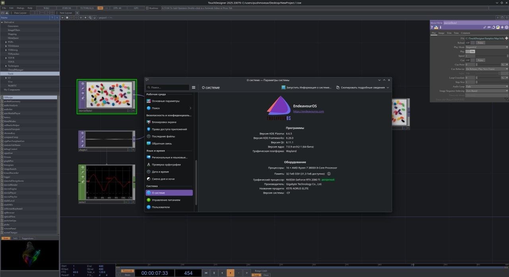
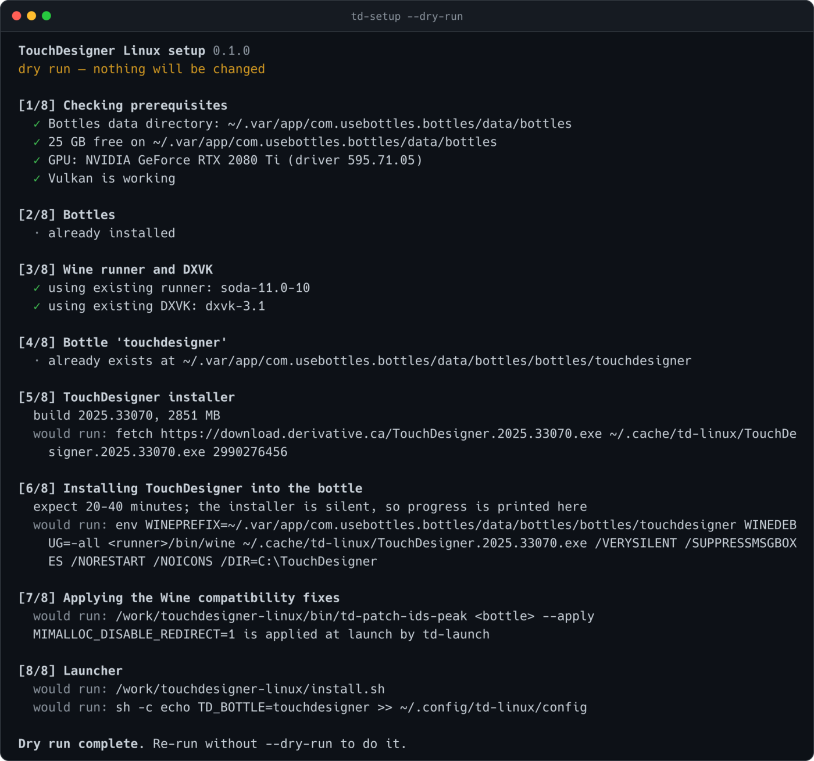
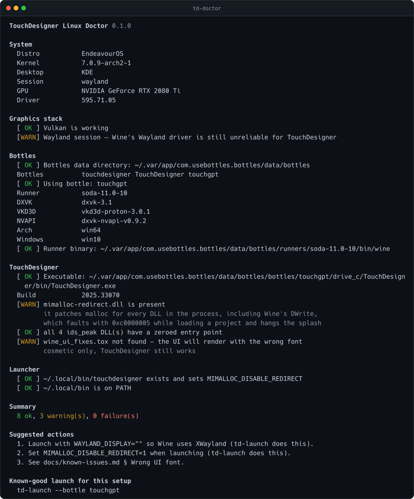

<div align="center">



# TouchDesigner на Linux

**Поставить TouchDesigner на Linux с нуля — и добиться, чтобы он реально
запустился.**


[English](README.md) · Русский

</div>



<div align="center"><sub>

TouchDesigner 2025.33070 · EndeavourOS · KDE Plasma 6.6.5 на Wayland · RTX 2080 Ti · Bottles + Wine

</sub></div>

У TouchDesigner нет сборки под Linux. Через Wine он работает хорошо — если
пережить момент, когда он нормально ставится, запускается и намертво зависает на
сплэш-скрине: без ошибки, без крэш-диалога и без единой подсказки в интерфейсе
Bottles, кроме **«Не отвечает»**. Причин пять. Ни одну не найти без debug-лога
Wine, а самая частая лечится одной переменной окружения, про которую нигде не
написано.

Этот репозиторий делает всё: ставит Bottles, качает Wine-runner, создаёт бутылку,
скачивает TouchDesigner, устанавливает его, применяет все известные фиксы и
добавляет ярлык в меню. Если всё равно не работает — `td-doctor` говорит, какая
из пяти причин у тебя.

## Быстрый старт

Не нужно ни знаний Wine, ни настроенного Bottles, ни скачанного TouchDesigner —
инсталлятор скачается сам. Аккаунт Derivative для **скачивания** не требуется
(лицензия нужна, чтобы им *пользоваться*; бесплатной non-commercial достаточно).

```sh
git clone https://github.com/pushmoveax/touchdesigner-linux.git
cd touchdesigner-linux
./install.sh          # положить команды в PATH
td-setup              # сделать всё
```

`td-setup` проходит восемь шагов и на каждом говорит, что делает. Понадобится
около 3 ГБ скачивания, 16 ГБ свободного места на время работы и 20–30 минут на
саму установку. Потом бутылка занимает около 9 ГБ. Посмотреть план, ничего не
меняя:

```sh
td-setup --dry-run
```



Потом:

```sh
touchdesigner         # или ярлык в меню приложений
```

<details>
<summary>Что именно делает td-setup</summary>

1. **Предпроверки** — `curl`, `tar`, `python3`, место на диске и работает ли
   Vulkan. Без Vulkan не работает DXVK, поэтому это проверяется до всех закачек.
2. **Bottles** — ставит с Flathub, если его нет.
3. **Wine-runner и DXVK** — использует то, что уже есть у Bottles, либо качает
   свежий [Soda](https://github.com/bottlesdevs/wine) и
   [DXVK](https://github.com/doitsujin/dxvk).
4. **Бутылка** — создаёт 64-битную с включённым DXVK.
5. **Инсталлятор** — качает официальную сборку с `download.derivative.ca`, с
   докачкой и проверкой размера.
6. **Установка** — запускает инсталлятор в бутылке. Это 7-Zip SFX вокруг Inno
   Setup, и «тихие» ключи доходят до внутреннего инсталлятора, так что кликать
   не надо — но закладывай **20–30 минут**: под Wine он сначала распаковывает
   ~2.9 ГБ внутрь prefix, а потом пишет ~8 ГБ мелких файлов.
7. **Фиксы** — патчит DLL из IDS Peak и обеспечивает
   `MIMALLOC_DISABLE_REDIRECT=1` при запуске. Почему — в
   [`docs/known-issues.md`](docs/known-issues.md).
8. **Лаунчер** — команда `touchdesigner` в PATH плюс ярлык с настоящей иконкой
   приложения, привязанный к только что собранной бутылке.

Каждый шаг сначала проверяет, не сделан ли он уже, поэтому повторный запуск после
обрыва продолжает, а не начинает заново. Недокачанный файл докачивается с места
обрыва.

</details>

### Полезные опции

```sh
td-setup --build 2026.10000            # конкретная сборка TouchDesigner
td-setup --installer ~/TD.exe          # уже скачанный инсталлятор
td-setup --bottle my-td                # имя бутылки
td-setup --dir 'C:\Apps\TD'            # другой каталог внутри бутылки
td-setup --yes                         # без вопросов
```

Номера сборок — на <https://derivative.ca/download>. Старые сборки Derivative с
хоста убирает, поэтому если сборка по умолчанию устарела, `td-setup` скажет об
этом и попросит `--build`.

## TouchDesigner уже стоит?

Тогда `td-setup` не нужен. Это вторая половина репозитория:

```sh
td-doctor              # что не так с этой машиной
td-doctor --log        # почему упал последний запуск
```

`td-doctor` только читает. Он смотрит систему, GPU, сессию, бутылку, runner,
DXVK, сборку TouchDesigner и известные проблемные DLL, после чего печатает
готовую команду на каждую найденную проблему. Ничего не меняется, пока ты сам её
не выполнишь.



### Когда висит и непонятно почему

```sh
td-launch --debug      # воспроизвести с подробным логом Wine
td-doctor --log        # сверить лог с известными сигнатурами
```

Лог всегда лежит в `~/.local/state/td-linux/last-run.log`, так что разбирать
падение можно и после закрытия терминала. `td-doctor --log` распознаёт зависание
mimalloc/DWrite, падения в `ids_peak`, падения в шрифтовом стеке, неразрешённые
импорты и ошибки создания устройства DXVK.

## Фиксы одной таблицей

`td-setup` применяет их все. Вот что это такое.

| Симптом | Причина | Фикс |
| --- | --- | --- |
| Висит на сплэше, около `1/72`, без ошибки | `mimalloc-redirect.dll` перехватывает malloc у `DWrite.dll` из Wine, тот падает с `0xc0000005` при перечислении шрифтов | `MIMALLOC_DISABLE_REDIRECT=1` |
| Падает в начале запуска, в бэктрейсе `ids_peak_*.dll` | Wine вызывает `DllMain` камерного SDK IDS Peak, и он падает | Обнулить `AddressOfEntryPoint` у четырёх DLL |
| Окно открылось, но не реагирует (KDE/Wayland) | Wayland-драйвер Wine | `WAYLAND_DISPLAY=""` — уходим на XWayland |
| Подтормаживание композитора на NVIDIA | драйвер крутится в busy-wait | `__GL_YIELD=USLEEP` |
| Интерфейс отрисован не тем шрифтом | подстановка шрифтов в Wine | `wine_ui_fixes.tox` |

Подробности — как выглядит в логе, почему работает и откуда взялось — в
[`docs/known-issues.md`](docs/known-issues.md). Та же установка руками, если не
хочется запускать скрипт, который что-то ставит, — в
[`docs/install.md`](docs/install.md).

## Команды

| Команда | Что делает |
| --- | --- |
| `td-setup` | Ставит всё с нуля. Идемпотентно, с докачкой, есть `--dry-run`. |
| `td-doctor` | Проверяет машину и печатает фикс на каждую проблему. Только чтение. |
| `td-doctor --log [FILE]` | Сверяет лог Wine с известными сигнатурами падений. |
| `td-launch` | Запускает TouchDesigner с рабочим окружением. Каждый фикс отключается отдельно — удобно бисектить. |
| `td-patch-ids-peak` | Обнуляет `AddressOfEntryPoint` в DLL из IDS Peak, с бэкапами и `--restore`. |
| `install.sh` | Кладёт всё это в `PATH`, добавляет ярлык. `--uninstall` откатывает. |

`install.sh` делает symlink'и в `~/.local/bin`, так что клон должен остаться на
месте (или перезапусти скрипт после переноса). Твои собственные файлы он не
затирает — всё, что мешает, сохраняется как `.bak`.

Нужно: `bash`, `python3`, `curl`, `tar`, `flatpak`. Опционально: `vulkan-tools` —
чтобы доктор мог проверить Vulkan, `icoutils` — чтобы вытащить иконку из
`TouchDesigner.exe`.

## Проверенные конфигурации

[`docs/compatibility.md`](docs/compatibility.md). Добавить свою машину — самый
полезный вклад: `td-doctor` печатает всё, что нужно для таблицы.

## Благодарности и чем это не является

Фиксы — не наши, их нашло сообщество TouchDesigner-на-Linux. Этот репозиторий их
автоматизирует и добавляет то, чего не было: шаг диагностики.

- [iswad-lab/TouchDesigner-Linux](https://github.com/iswad-lab/TouchDesigner-Linux)
  — уже существующий автоматический установщик: несколько версий, иконки, фиксы
  UI и шрифтов. **Если нужен вылизанный установщик — бери его.** Этот проект
  сознательно пересекается с ним по установке, а отличается тем, что занимается
  *диагностикой*: `td-doctor` читает твою машину и твой лог Wine и называет
  причину, вместо того чтобы применить фиксированный список фиксов и надеяться.
- [gist bluejorts про Proton 10](https://gist.github.com/bluejorts/91e86a41099966b11e7248f52ac38e28)
  — где зависание mimalloc/DWrite и `MIMALLOC_DISABLE_REDIRECT=1` были описаны
  впервые.
- [Claudius Coenen, *TouchDesigner on Linux using Bottles and Wine*](https://www.claudiuscoenen.de/2024/09/touchdesigner-on-linux-using-bottles-and-wine/)
  — откуда пошёл трюк с `AddressOfEntryPoint` для IDS Peak.
- Треды на форуме Derivative:
  [экспериментальная сборка через Bottles](https://forum.derivative.ca/t/experimental-setup-touchdesigner-on-linux-via-bottles-2025-10-04/809825),
  [daily-driver setup](https://forum.derivative.ca/t/running-touchdesigner-on-linux-via-bottles-my-daily-driver-setup/978051),
  [минорные UI-фиксы под Wine](https://forum.derivative.ca/t/minor-ui-fixes-for-touchdesigner-on-wine-2025-11-29/973692).

TouchDesigner — продукт [Derivative](https://derivative.ca). Проект с ними не
связан, запуск через Wine ими не поддерживается. Лицензия всё равно нужна;
бесплатной non-commercial достаточно.

Графика: иконка TouchDesigner в шапке взята из `TouchDesigner.exe` и принадлежит
Derivative, использована только для обозначения приложения. Tux — работа Larry
Ewing, сделана в The GIMP.

## Лицензия

MIT — см. [`LICENSE`](LICENSE).
